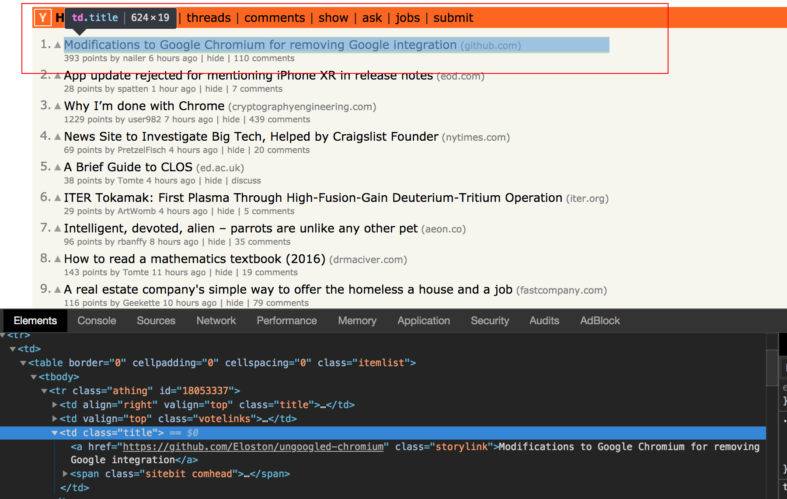

## Tutorials

This tutorial shows how to scrape [Hacker News](https://news.ycombinator.com/news) in **ruia**.

## Creating a project

Before all, you will have to set up a new ruia project, create a `hacker_news_spider` directory with the following contents:

```shell
hacker_news_spider
├── db.py
├── hacker_news.py
├── items.py
└── middlewares.py
```

## Item

`Item` is used to define the elements what you want to scrape from a website, and at this time, our targets are `titles` and `urls` from [Hacker News](https://news.ycombinator.com/news).

There are tow methods to get elements from a website supported by **ruia**, [CSS Selector](https://www.w3schools.com/cssref/css_selectors.asp) and [XPath](https://www.w3schools.com/xml/xpath_intro.asp).

> PS: `CSS Selector` is prefered in this tutorial by default.

OK, let's start our jobs. First, open the website [https://news.ycombinator.com/news](https://news.ycombinator.com/news), and then right-click the page and choose Inspect or Inspect Element, you will see something like this:



You can find that title's element is a HTML tag `<a></a>` with properties `class=storylink` and `href=https://example.com`, so we can get something like this:

| Param       | Selector          | Description       |
| :---------- | ----------------- | ----------------- |
| target_item | tr.athing         | each news item    |
| title       | a.storylink       | title of news     |
| url         | a.storylink->href | url of news       |

That's enough, let's define the news item. Edit `items.py` and input this code:

```python
from ruia import AttrField, TextField, Item


class HackerNewsItem(Item):
    target_item = TextField(css_select='tr.athing')
    title = TextField(css_select='a.storylink')
    url = AttrField(css_select='a.storylink', attr='href')
```

Pretty easy, right? Create a class inherit from `Item` and define some properties, and done😏. There is a special property `target_item`, is a list of items' element we want to scrape.

## Middleware

Each middleware is responsible for doing some specific function before request or after response. If we want to add `User-Agent` into `Headers` before each request, middleware is a best way to do the job. Put this code in file `middlewares.py`:

```python
from ruia import Middleware

middleware = Middleware()


@middleware.request
async def print_on_request(request):
    ua = 'ruia user-agent'
    request.headers.update({'User-Agent': ua})
```

If you done, your spider will add `User-Agent` before each request automatically.

## Data persistence

We gonna use `MongoDB` to store the data what we scrape by ruia. Open `db.py` and fill it with code:

```python
import asyncio

from motor.motor_asyncio import AsyncIOMotorClient


class MotorBase:
    """
    About motor's doc: https://github.com/mongodb/motor
    """
    _db = {}
    _collection = {}

    def __init__(self, loop=None):
        self.motor_uri = ''
        self.loop = loop or asyncio.get_event_loop()

    def client(self, db):
        # motor
        self.motor_uri = f"mongodb://localhost:27017/{db}"
        return AsyncIOMotorClient(self.motor_uri, io_loop=self.loop)

    def get_db(self, db='test'):
        """
        Get a db instance
        :param db: database name
        :return: the motor db instance
        """
        if db not in self._db:
            self._db[db] = self.client(db)[db]

        return self._db[db]
```

## Spider

`Spider` is the program's entry, it combines the `Item`, `Middleware` and other components togather, to make programs work better.

In this example, the hacker news spider will scrape the first two pages, put the code in `hacker_news.py`:

```python
from ruia import Request, Spider

from items import HackerNewsItem
from middlewares import middleware
from db import MotorBase


class HackerNewsSpider(Spider):
    start_urls = ['https://news.ycombinator.com']
    concurrency = 3

    async def parse(self, res):
        self.mongo_db = MotorBase().get_db('ruia_test')
        urls = ['https://news.ycombinator.com/news?p=1', 'https://news.ycombinator.com/news?p=2']
        for index, url in enumerate(urls):
            yield Request(
                url,
                callback=self.parse_item,
                metadata={'index': index}
            )

    async def parse_item(self, res):
        items = await HackerNewsItem.get_items(html=res.html)

        for item in items:
            try:
                await self.mongo_db.news.update_one({
                    'url': item.url},
                    {'$set': {'url': item.url, 'title': item.title}},
                    upsert=True)
            except Exception as e:
                self.logger.exception(e)


if __name__ == '__main__':
    HackerNewsSpider.start(middleware=middleware)
```

`HackerNewsSpider` subclasses `Spider`, and must implement method `parse()`.

Run `python hacker_news.py` to launch hacker news spider:

```shell
[2018-09-24 17:59:19,865]-ruia-INFO  spider : Spider started!
[2018-09-24 17:59:19,866]-Request-INFO  request: <GET: https://news.ycombinator.com>
[2018-09-24 17:59:23,259]-Request-INFO  request: <GET: https://news.ycombinator.com/news?p=1>
[2018-09-24 17:59:23,260]-Request-INFO  request: <GET: https://news.ycombinator.com/news?p=2>
[2018-09-24 18:03:05,562]-ruia-INFO  spider : Stopping spider: ruia
[2018-09-24 18:03:05,562]-ruia-INFO  spider : Total requests: 3
[2018-09-24 18:03:05,562]-ruia-INFO  spider : Time usage: 0:00:02.802862
[2018-09-24 18:03:05,562]-ruia-INFO  spider : Spider finished!
```

After `Spider finished!`, open the database to have a look:


As you can see, this is **ruia**.

This example's code: [hacker_news_spider](https://github.com/howie6879/ruia/tree/master/examples/hacker_news_spider).

Next time, we'll learn [how to write a **ruia** plugin](./plugins.md)
